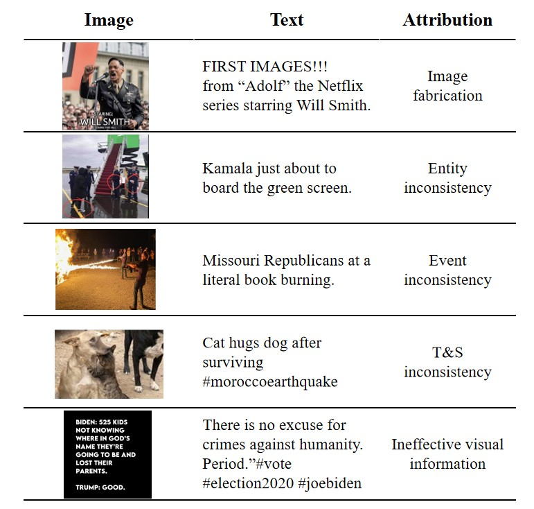
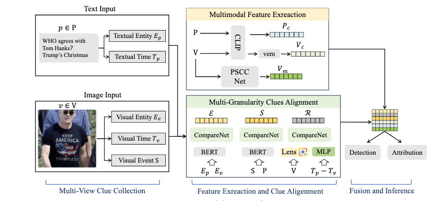

# An Attributing Multi-granularity Multimodal Fake News Dataset

⚠️ Recently, we received feedback regarding potentially inappropriate content in our media. In response, we have removed the relevant images and text. If you have any further concerns, please do not hesitate to contact us.

## Introduction
This is our new research paper, "Each Fake News is Fake in its Own Way: An Attribution Multi-Granularity Benchmark for Multimodal Fake News Detection", which includes the dataset and method implementation. Unlike existing fake news detection tasks, AMG aims not only to detect the authenticity of multimodal news but also to classify the attribution of the fake news. We construct an attributing multi-granularity multimodal fake news detection dataset AMG and introduce the novel task of multimodal fake news attribution FOR THE FIRST TIME, which not only detects the authenticity of news but also provides error attribution, thereby enhancing the credibility of detection models.
## Dataset

### Get the media:
Download the media of AMG dataset through this link: [Google Drive](https://drive.google.com/file/d/1hybdqITNwUB8ejGMUVnKCFHYyLlHtcrh/view?usp=drive_link)
## Method
### Pipeline of MGCA

